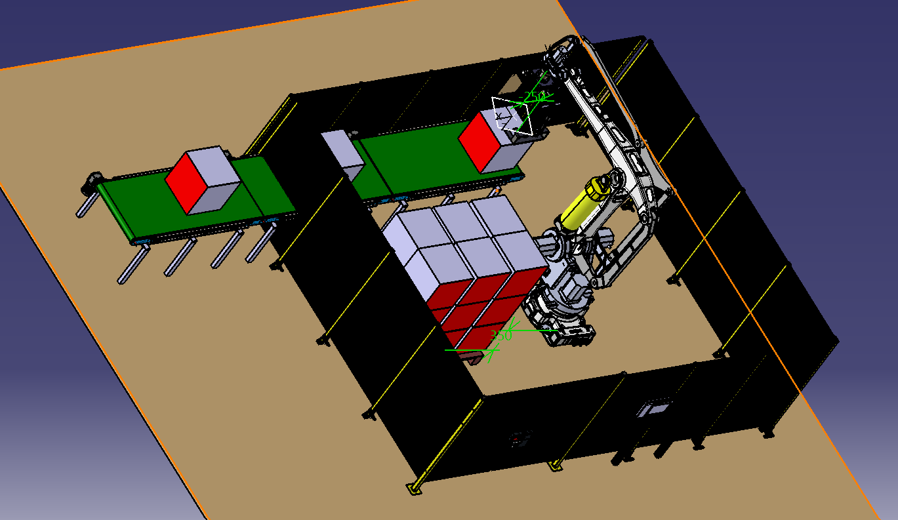

# Robot de palettisation – Projet de Fin d’Études

## Contexte du projet

Ce projet consiste à concevoir une cellule robotisée destinée à la palettisation de blocs compactés issus d’une ligne de conditionnement.  
L’objectif est d’automatiser la prise, le transfert et la dépose des blocs sur palette tout en assurant la sécurité de l’opérateur, la fiabilité de la préhension et la bonne organisation de la zone de stockage.

---

## Objectifs du projet

- Concevoir une cellule robotisée de palettisation.
- Développer un préhenseur adapté à des blocs lourds.
- Intégrer un système de serrage pneumatique et un système anti-chute.
- Réaliser l’analyse fonctionnelle et l’analyse de risque.
- Préparer les schémas électriques sous SEE Electrical.
- Dimensionner l’installation électrique sous Caneco BT.
- Simuler les trajectoires robot sous DELMIA / MODOU IDE.
- Préparer la logique de programmation API Siemens.

---

## Outils utilisés

| Domaine | Outils |
|---|---|
| Conception mécanique | CATIA V5 |
| Simulation robotique | DELMIA / MODOU IDE |
| Automatisme | Siemens TIA Portal |
| Supervision | WinCC / HMI |
| Schémas électriques | SEE Electrical |
| Dimensionnement électrique | Caneco BT |
| Analyse de risque | AMDEC, ISO 12100 |

---

## Architecture générale de la cellule

La cellule est composée de :

- Un convoyeur d’alimentation.
- Une zone de positionnement du bloc.
- Un robot palettiseur industriel.
- Un préhenseur pneumatique.
- Une palette de stockage.
- Une enceinte grillagée de sécurité.
- Une armoire électrique avec API Siemens et IHM.
- Une communication robot/API via PROFINET.

---

## Conception du préhenseur

Le préhenseur est basé sur un principe de serrage par friction.  
Il comporte une mâchoire fixe et une mâchoire mobile actionnée par un vérin pneumatique double effet.

Un système anti-chute est ajouté afin de sécuriser le transport du bloc après la prise.

---

## Conditions de sécurité avant levage

Le levage du bloc est autorisé uniquement si les conditions suivantes sont validées :

- Présence du bloc détectée.
- Serrage fermé.
- Anti-chute fermé.
- Pression de serrage correcte.
- Pression anti-chute correcte.

Cette logique permet d’éviter le transport d’un bloc mal serré ou non sécurisé.

---

## Étude électrique

L’étude électrique comprend :

- Bilan de puissance.
- Choix du sectionneur général.
- Choix des protections par départ.
- Départ robot.
- Départ moteur convoyeur.
- Départ alimentation 24 VDC.
- Intégration d’une alimentation SITOP.
- Ajout d’une réserve d’énergie 24 VDC.
- Préparation des schémas sous SEE Electrical.

---

## Simulation robotique

La simulation robotique permet de vérifier :

- L’accessibilité du robot.
- Les trajectoires de prise et de dépose.
- Les risques de collision.
- La position du convoyeur.
- La position de la palette.
- La faisabilité du cycle complet.

---

## Résultats obtenus

- Architecture globale de la cellule définie.
- Conception du préhenseur réalisée.
- Logique de sécurité avant levage définie.
- Architecture pneumatique étudiée.
- Architecture électrique préparée.
- Simulation robotique en cours de validation.
- Préparation de la programmation API Siemens.

---

## Compétences développées

- Robotique industrielle.
- Conception mécanique.
- Automatisme Siemens.
- Pneumatique industrielle.
- Sécurité machine.
- Dimensionnement électrique.
- Simulation industrielle.
- Analyse fonctionnelle et AMDEC.

---

[⬅ Retour à l’accueil]({{ '/' | relative_url }})
